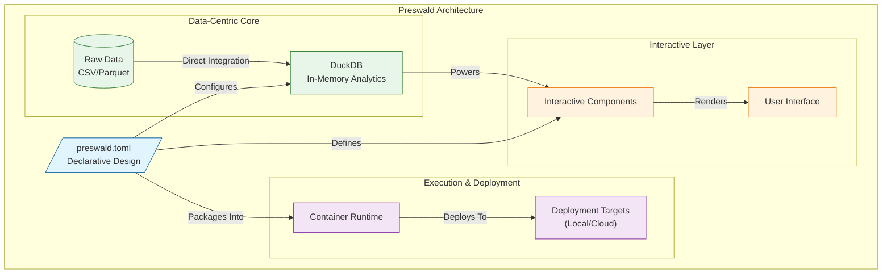

Preswald is built to simplify the process of creating dashboards and data apps by focusing on a few core principles: **declarative design**, **data as a first-class citizen**, and **efficient deployment**. These concepts are at the foundation of its architecture and influence every aspect of how it is used.

---

### 1️⃣ **Declarative Design**

Preswald is built on the idea that describing what an application should do is more efficient than specifying how to do it. A single configuration file, `preswald.toml`, defines the application's behavior, presentation, and data connections.

- **Clear Structure**: The configuration separates logic from setup, making it predictable and easy to follow.
- **Portability**: Apps can be reproduced or shared with minimal effort.
- **Focus on Logic**: Developers can spend time on what the app should do, not on repetitive setup.

---

### 2️⃣ **Data-Centric Architecture**

Preswald treats data as the central element of its architecture. It integrates directly with **DuckDB**, a columnar in-memory database, enabling efficient analytics without requiring a heavyweight backend.

- **Direct Integration**: Preswald works natively with structured data formats like CSV and Parquet, reducing the need for intermediate steps.
- **In-Memory Analytics**: DuckDB processes data directly in memory, optimizing for analytical workloads and query performance.
- **Dynamic Data Interactions**: Applications interact with live data, enabling dynamic visualizations and parameter-driven workflows without additional complexity.

---

### 3️⃣ **Interactive Components as Building Blocks**

Preswald provides a library of interactive components that operate as composable building blocks. These components allow developers to create dynamic, user-driven applications while remaining focused on their data logic. Key technical principles include:

- **State-Driven Interaction**: Components like `slider()` and `selectbox()` allow users to interact with the data pipeline by directly modifying parameters or filters.
- **Declarative Behavior**: Each component is defined with a simple function, abstracting away the implementation details of the underlying UI or state management.
- **Integration with Data**: Components are designed to tightly couple with data processing logic, enabling a seamless feedback loop between user input and application output.

---

### 4️⃣ **Efficiency and Lightweight Execution**

Preswald's execution model prioritizes efficiency by leveraging lightweight, in-process execution and local-first design principles. Key aspects include:

- **Minimized Resource Footprint**: Applications run locally or in-memory using DuckDB, reducing the need for additional infrastructure during development.
- **Optimized for Analytics**: Queries and transformations are executed within the same process, reducing latency and overhead.
- **Local-First Workflow**: Development occurs in an environment that mirrors production behavior, ensuring consistency between testing and deployment.

---

### 5️⃣ **Pragmatic Deployment Model**

Preswald is built around the idea that deploying an application should be straightforward and adaptable to different environments. The deployment process is designed to prioritize control and transparency:

- **Explicit Targets**: Applications can be deployed locally for testing or to cloud environments such as Google Cloud Run, without requiring complex orchestration tools.
- **Container-Based Isolation**: Every application is packaged as a container, ensuring consistency across environments.
- **Developer Control**: Deployment involves explicit steps and decisions, ensuring that engineers retain full visibility into the process.

---

### 6️⃣ **Minimalism and Composability**

Preswald is intentionally minimal in scope. It provides only the tools necessary to define, build, and deploy data applications, leaving room for integration with other systems or libraries. This philosophy is reflected in:

- **Focused Features**: Preswald avoids unnecessary features or abstractions, reducing cognitive load and increasing reliability.
- **Composability**: Applications and workflows can be composed from small, independent pieces, making it easier to build modular systems.
- **Transparent Design**: The architecture is simple and explicit, making it easy to understand and debug.

---

### Philosophy: Tools That Stay Out of the Way

Preswald is designed for engineers who value simplicity, performance, and control. It avoids imposing heavy-handed frameworks or opinions, instead focusing on providing the tools needed to turn raw data into actionable insights. By adhering to principles of declarative design, efficient execution, and composability, Preswald reflects a core belief:

**Good tools make complexity manageable without obscuring it.**
