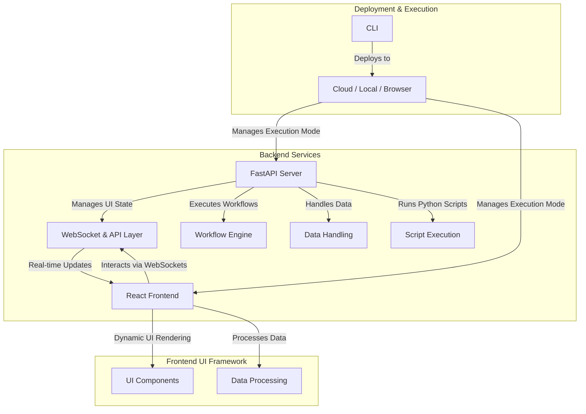
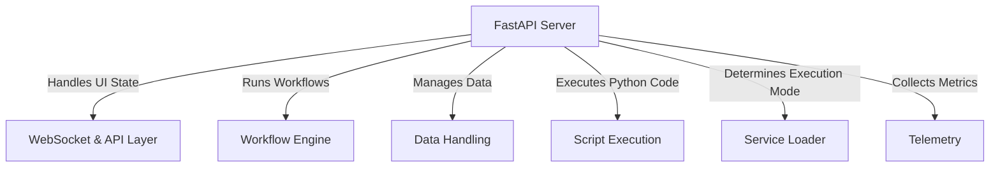
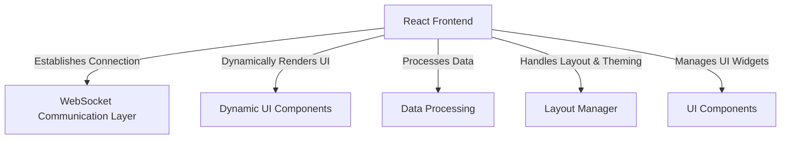
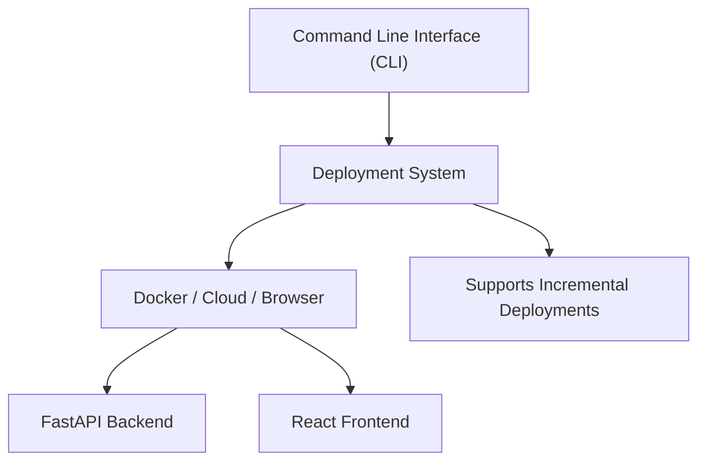
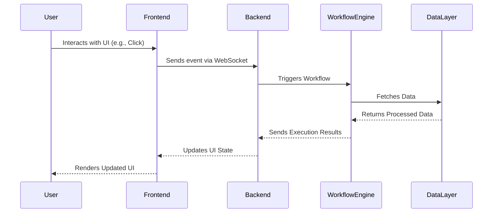

Preswald is a framework for building interactive applications with Python. It has a FastAPI backend for managing UI state, workflows, and real-time updates, and a React frontend that dynamically renders components. It supports both server-based execution with FastAPI and browser-based execution with Pyodide. Apps can be deployed locally, in the cloud, or run entirely in the browser, making it easy to build and share interactive data apps.

## **1. System Overview**

Preswald is structured around three primary subsystems:

1. **Backend Services** – FastAPI-based server that manages UI state, real-time execution, and workflow automation.
2. **Frontend UI Framework** – React-based client that dynamically renders UI components and interacts with the backend.
3. **Deployment & Execution** – A flexible deployment system that supports local, cloud, and browser-based execution.
   

## **2. Core Components and Interactions**

### **2.1 Backend Services**

The backend is built on **FastAPI** and is responsible for managing application state, handling real-time communication, executing workflows, and serving UI components to the frontend. It consists of several key modules:

#### **Main Server (`main.py`)**
- Initializes a **FastAPI app** with CORS and WebSocket support.
- Serves the frontend UI.
- Manages **WebSocket connections** for real-time updates.
- Injects **dynamic branding** into the frontend.
- Runs on **port 8501** using `uvicorn`.

#### **WebSocket & API Layer (`server_service.py`)**
- Establishes **bi-directional communication** between the frontend and backend.
- Receives UI state updates from clients.
- Sends real-time UI changes and execution results.
- Manages multiple **concurrent WebSocket sessions**.

#### **Workflow Execution Engine (`workflow.py`)**
- Defines **reactive workflows** using automatically tracked atoms (`@workflow.atom()`).
- Manages **caching, retries, failure recovery, and DAG-based reruns**.
- Provides **execution tracking and visualization**.
- Executes **data transformation and computational pipelines**.

#### **Data Handling (`data.py`)**
- Connects to **external data sources** (SQL, NoSQL, in-memory storage).
- Runs **SQL queries** and retrieves results as **Pandas DataFrames**.
- Integrates with the **workflow engine** for structured data processing.

#### **Script Execution (`runner.py`)**
- Runs Python scripts dynamically within the backend.
- Captures **standard output** and sends results to the UI.
- Ensures **efficient script execution with state persistence**.
- Prevents unnecessary re-execution using **debouncing**.

#### **Service Loader (`service.py`)**
- Dynamically determines whether to use **server-based** (FastAPI) or **browser-based** (Pyodide) execution.
- Provides a **unified API** for managing UI state, workflows, and script execution.

#### **Telemetry (`telemetry.py`)**
- Collects **usage analytics** on executed commands and data sources.
- Allows users to **opt-out** of telemetry.
- Sends **aggregated performance insights** to cloud services.

---

### **2.1.1 Reactive Runtime and DAG-based Execution**

Preswald's workflow engine includes a **reactive runtime** that selectively reruns only the parts of your script affected by user interaction or upstream changes. This avoids redundant computation and enables fast, responsive apps, even as workflows grow complex.

At the core of this system is a **DAG (Directed Acyclic Graph)** of atoms, where each atom represents a computational unit (e.g., a widget, transformation, or result display). The runtime automatically tracks:

- **Which atoms produced which UI components**
- **Which atoms depend on the outputs of others**
- **Which values have changed**, using stable component IDs and hashing

#### Key Benefits

- **Selective execution**: Only changed atoms and their downstream dependents are recomputed
- **Flexible dependency tracking**: Dependencies can be **manually declared** or **automatically inferred** from function arguments
- **Minimal boilerplate**: Build reactive UIs using composable Python functions

This model allows you to build complex workflows that feel simple to maintain, whether you prefer to declare dependencies explicitly or let Preswald infer them automatically.

Want to see it in action? [Check out the `Workflow` guide →](./sdk/workflow)

---

### **2.2 Frontend UI Framework**

The frontend is a **React-based** application that renders UI components dynamically and communicates with the backend through **WebSockets and REST APIs**. It is built using **Vite, Tailwind CSS, and ShadCN**.

#### **Frontend Core (`App.jsx`)**
- Manages the **WebSocket connection** with the backend.
- Receives **UI component updates** and re-renders them dynamically.
- Handles **connection status, errors, and branding updates**.

#### **WebSocket Communication Layer (`websocket.js`)**
- Establishes a **real-time connection** to the backend.
- Synchronizes **component state between frontend and backend**.
- Implements **automatic reconnection** if the connection drops.
- Uses **PostMessage API** for browser-based execution.

#### **Dynamic UI Rendering (`DynamicComponents.jsx`)**
- Maps **backend-defined UI components** to React components.
- Supports interactive elements such as **buttons, sliders, tables, and charts**.
- Implements **memoization** to prevent unnecessary re-renders.

#### **Data Processing (`dataprocessing.js`)**
- Handles **large dataset visualization** by applying **downsampling and compression**.
- Uses **LTTB (Largest-Triangle-Three-Buckets) algorithm** for time-series data.
- Ensures **efficient data transmission** between frontend and backend.

#### **Layout and Theming (`Layout.jsx`)**
- Manages **UI layout, navigation, and branding**.
- Loads **dynamic branding assets** from the backend.
- Provides a **responsive user interface**.

#### **UI Components (`widgets/`)**
- Contains reusable UI component definitions.
- Handles **user interactions and state updates**.

---

### **2.3 Deployment & Execution**

Preswald supports **local, cloud, and browser-based execution** through a modular deployment system.

#### **Command-Line Interface (`cli.py`)**
- Provides CLI commands for **initialization, execution, and deployment**.
- Handles **project creation, local server startup, and structured deployments**.

#### **Deployment System (`deploy.py`)**
- Automates **local (Docker), Google Cloud Run, and Structured Cloud** deployments.
- Manages **container builds, service registration, and cleanup**.
- Supports **incremental deployments** with minimal downtime.

#### **Browser-Based Execution (`virtual_service.py`)**
- Runs Preswald **entirely in the browser using Pyodide**.
- Simulates **WebSocket communication** through **PostMessage API**.
- Executes scripts dynamically within a **sandboxed Python runtime**.

#### **Service Initialization (`entrypoint.py`)**
- Bootstraps **Preswald in the browser**.
- Exposes **Python functions to JavaScript**.
- Manages **UI state without a backend**.

---

## **3. System Interaction Flow**

### **3.1 Application Startup**
1. The **backend initializes** a FastAPI server and loads configuration.
2. The **frontend connects** to the backend via WebSockets.
3. Preswald **loads UI components dynamically** based on the backend state.
4. The **UI is rendered** and becomes interactive.

### **3.2 User Interaction**
1. A user **interacts with a UI component** (e.g., slider, button).
2. The **frontend sends an event** to the backend through WebSockets.
3. The **backend processes the event**, updates the UI state, and runs workflows if needed.
4. The **new UI state is sent back** to the frontend and updated in real-time.

### **3.3 Workflow Execution**
1. A **workflow is triggered** based on user input or scheduled execution.
2. The **workflow engine resolves dependencies** and executes tasks.
3. The **output is processed** and stored in the **data handling layer**.
4. The **UI updates dynamically** based on workflow results.

### **3.4 Deployment**
1. A user runs `preswald deploy` from the CLI.
2. The **deployment system packages** the application.
3. The package is **deployed to a target environment** (Docker, GCP, or Structured Cloud).
4. The **app is started in the new environment**, and users can access it.

---

## **4. Execution Modes**

Preswald can operate in different execution modes:

1. **Server Mode (FastAPI)**
   - Runs in a **containerized or cloud environment**.
   - Uses **FastAPI for API serving and WebSockets for real-time updates**.
   - Suitable for **scalable, multi-user applications**.

2. **Browser Mode (Pyodide)**
   - Runs **entirely in the browser** without a backend.
   - Uses **Pyodide to execute Python scripts in JavaScript**.
   - Suitable for **lightweight, client-side applications**.

---

Preswald provides a **modular and scalable system architecture** for building interactive Python applications. It integrates a **FastAPI backend, a React-based frontend, a real-time WebSocket communication layer, a workflow execution engine, and a flexible deployment system**.